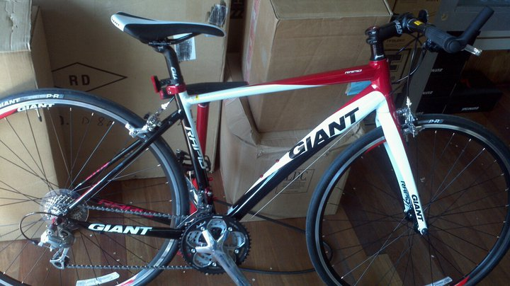

*first day of biking in nyc with brother*

Like all things new, I was a bit apprehensive about commuting to work on a bicycle when my brother first suggested it. I had not been on a bicycle since late 90s. Even as a kid I never really owned a bike. I learned how to ride one though, at the age of 5 or 6 in Motihari on my brother's blue A1 cycle. So in my defence, having never 'really' ridden a bike, the idea of maneuvering through traffic on New York City streets would appear to be a daunting task for anyone really. Nevertheless, my brother's coaxing and promises of me loving it led to me renting a bike and following him to central park on a bright spring day of 2011. As I rode through the park among the gorgeous trees that were showing off this year's new leaves in the sun, I knew I wanted to do this again. And On the first big downhill near the north-east part of the park I decided to buy a bike.

*brand new bike*

Fast forward a few months, I had a bike which I primarily used for commuting to work. I was mighty proud of it, for there's a sense of community among people who ride to work. And pride is a just feeling too, for very few acts have so many merits - It gets  you to work every day, you reduce your carbon footprint and you keep fit! Be proud my fellow riders. However, cycling long distance was never something I even thought about till I met a coworker, Adam. He wanted me to ride with him to Jersey one of the coming weekends. Traveling to another state? On a bike? That sounded like something you could brag about… so I decided to give it a try. My first long ride took me through the entire east coast of jersey down to Staten Island and then back into Manhattan - A 60 mile (then) behemoth of a ride. Next morning, My arse was sore and my thighs burnt with every pedal as I got to work, but I had a 60 mile route map on my phone to show off my weekend's achievement. 
Over the next few months, Adam and I took many rides into Jersey, around the city, discovered various places in new york and new jersey on our bikes. We created a group chat at work for others who were interested in cycling (that group is now about 30 people strong). Even after doing many 40-50 mile rides, I laughed when Adam suggested we do a 100 mile ride in the fall of 2012. He must obviously be joking because we almost die at the end of our 40-50 milers… but he was serious. In the meantime, other coworkers/group members got new bikes and owing to their enthusiasm (as with most things new) they transformed the chat into a walking encyclopedia of cycling. I realized how important a good 'fit' was, how to perform maintenance on my bike, the various parts and brands etc. But even after learning a lot more than the previous year about biking, I knew I lacked the stamina for a 100 mile ride… I wasn't ready. 

*The Group*

One morning while riding to work, as I approached the up-slope of the queens borough bridge… I was lost in my thoughts about last night's swimming lesson. For some reason I decided to practice the breathing technique the trainer had showed me as I was riding up the hill. A few minutes later I was over the hill and unlike usual… I wasn't panting or gasping for air. It is about half a mile or so of straight uphill that I dreaded going over everyday. Today though, I didn't even feel it. I realized then that I wasn't breathing right before. On my next long ride, I continued experimenting more with breathing techniques and was amazed to see the results. In a state of bliss the next day I signed up for the 100 mile event.
Fast forward again to the day of the event. I had done everything right to prepare for this ride… from carb-loading to making sure my bicycle was tuned up right. The only things that bothered me a bit were the facts that I had injured my shoulder earlier in June and my knee was hurting during the last practice ride. Either way, I was too excited to even consider these minor problems. I can only describe my feeling at the starting line as that of pure joy. I had a lot of good friends here with me, some doing 50 miles… some attempting the 100 with me. But most of all, I was proud of myself to have come to this 100 mile event and that too for a good cause. Everything was great for the first 20 miles… after which I started noticing my right knee acting up again. I was a bit nervous about it but I tried to focus on the ride itself. 50 miles into the ride the pain was bad. I had fallen far behind the others mostly because I wanted to take it easy on my knees. Every 25 miles or so we had rest stops, and I cannot be thankful enough for those. As we had prepped, I'd stuff myself with just enough food to make sure I don't get hungry till the next stop. This was about the time while riding alone that I realized I was talking to myself. It was completely involuntary and automatic. I guess you need to be able to do things to keep your mind off the pain. When talking was not enough I tried to take in the scenery to distract myself- the area up north of new york/jersey is just beautiful in the fall. It looked like it was straight out of some painting. At about 60 mile mark… we went through a series of hills and troughs. As much as I hated those hills with my knee situation… I have to be a little thankful too (perhaps this is stupid to say) but after those hills… my knee became numb. A curse or boon I'd decide later but for now I was able to pick up my cadence and in a few miles I caught up with my group again. 
As I crossed the finish line I was happy and I was proud. This was one of the most challenging things I've done physically so far, and I was fortunate enough to have done it with a great group of people. So with pride in my heart and a new found respect for mind over matter, **I hereby take "biking 100 miles" off my 30 before 30 list**.

*At the Finish Line*