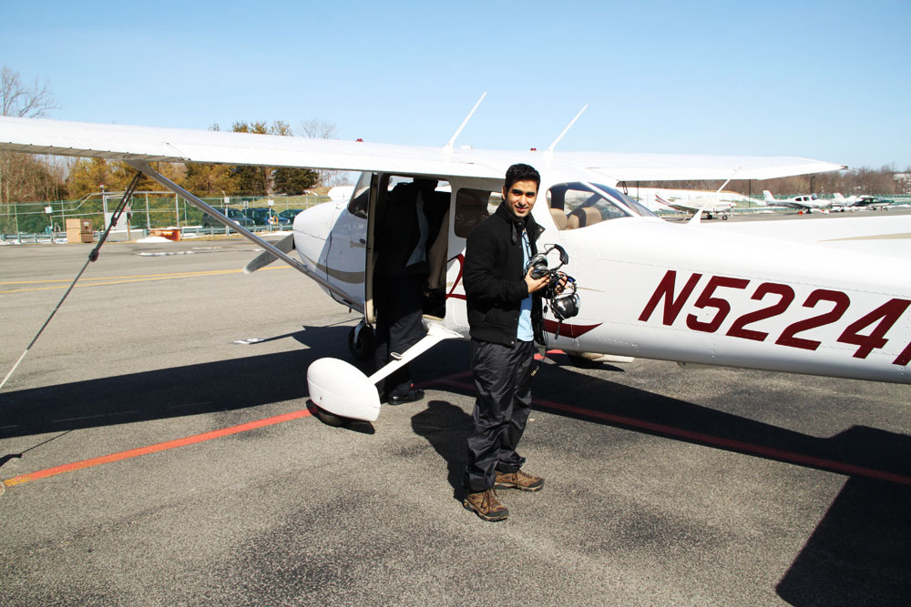

So... you know those kids that from their seminal childhood had this dream to one day fly a plane and soar through the crimson skies? I was never that kid. Don't get me wrong, I loved Top Gun dog fights just as much as any adrenalin loaded pre-teen kid would, but I was never fascinated about the flying part. Nevertheless, it was something that I really wanted to get a taste of, if for no other reason than to know what fascinates people like my brother about flying. 

One of the really great things about being in USA is that if you want to try something cool, there's always someone ready to sell you that experience. So usually what lies between you and something you wanna do are two things - 1. money and 2. your ability to get out of your comfort zone. When I heard that there are companies right here in NYC that will let you fly a plane, a voice in my head went - out of your comfort zone... forget about it. I was still struggling with whether I should do it or not when I put it on my list. Once it was part of the list, the struggle was over. "Why" changed into "Why not?". I have always been curious about it, I have an opportunity to find out... Why the heck not? I guess it has to do something with putting things down in writing. We have all heard the benefits of making lists, pros and cons etc. It really does help a lot. but I digress...

It's on the list, time to make it happen. I have to thank a collegue from work for arranging it for if it was upto me, I might have actually just waited for enough time to pass so as to justify crawling back into my comfort zone. So he signed us up and on the day of the flight experience I had to drive us both to the hangar. I went to pick up the car from parents' place and informed them about my plans for the day. Their reaction was somewhat expected - "Why would you do this? small planes crash all the time!!" I liked that they got so worried, means they thought it was a big deal :). I wasn't really worried about crash etc. Thanks to the "I sue you" era of US, any service providing agency (specially experiences that can get you killed), probably (I hope) go through rigorous security checks. Besides, I was more worried about how I was going to drive to this place (Driving makes me really nervous... but i'm getting better).

So we finally arrived at the hangar and I was feeling mighty proud of myself for having driven successfully before I saw the tiny planes on the runway and it kinda sunk in... I'll be flying in one of them soon. I have only ever seen these in movies. 10 years ago, I could never have imagined that one day I'd get to see what it's like to fly a plane just for fun! After about 20 minutes of quick info session, my friend and I were taken to our plane. It was a Cessna 172S. A beautiful little plane with a very nice avionics. I got to fly first. 

And what an experience it was - from taxiing on the ground to taking off at 55mph and then making those turns. The pilot next to me kept asking me how I was feeling. It was one of those moments where you try to find the most expressive word in your vocab and as soon as you have used it you realize that you have grossly understated the experience."Awesome", "Amazing"... I use it for so many plebeian things in life that I actually struggled to come up with a response. A really wide smile would have to do for now. Two things I noted during the flight - 1. The tech in these planes is pretty amazing. There were planes so far ahead of us that you could hardly see it as something more than a spec. Yet the aircraft was able to detect and warn us of traffic ahead. 2 - A pilot hardly ever looks out the windshield. The instructor next to me kept telling me to bring the nose up/down etc and I kept wondering how does he judge it so well? I know I sound incredibly stupid, but it actually took me a while to realize this. It's not like driving or biking where you make decisions based on what you observe in the real world. The entire flying is based on the input your tiny monitors are providing you with - where you are with respect to the horizon, how high, how much tilt. This is one vehicle where the reliance on technology is pretty scary.

To know what maneuvering a powerful machine through the air feels like, will definitely go down as one of the most unique experiences of my life. With that thought, **I'm now taking "Fly a plane" off my 30 before 30 list**.

