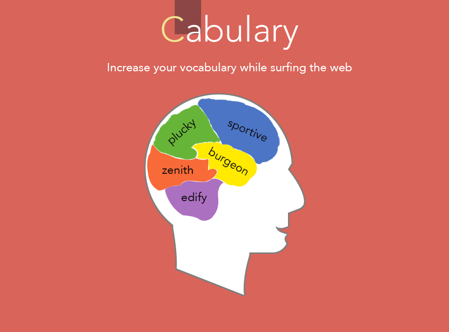
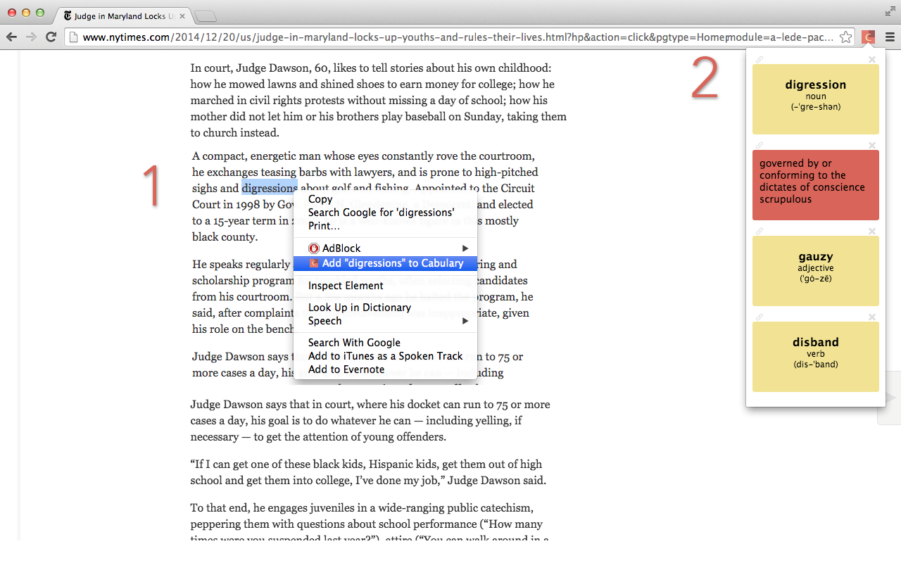

<a href="https://chrome.google.com/webstore/detail/cabulary/ejefgmegpcimohilbkiioplokdiangpd" target="_blank" class="btn btn-primary">Extension Link</a><a href="https://chrome.google.com/webstore/detail/cabulary/ejefgmegpcimohilbkiioplokdiangpd" target="_blank" class="btn btn-default">Github Link</a>

#Overview

A chrome extension that allows you to create vocabulary flash cards of words you encounter while surfing the web. The flash cards flip on hover, revealing the meaning of the words. 

#The Story

While I was reading my Kindle on the subway the other day, I realized that one of the features I love about e-readers, is the ability to look up meanings of words right away. Thanks to me being the king of mediocre vocabulary, I use this feature very frequently. However, no matter what I try it is tough for me to retain the meaning of the word I just looked up a few days from now. 

I was thinking, it would be so cool if Kindle automatically created flash cards of the words I looked up, so I could cycle through them at my leisure. Subways' rhythmic track noise is always a great enabler for my runaway thoughts. Eventually, I endedup resolving to create something similar for browsers. 

When I came home, I looked up how to create extensions for Chrome. Then I did some research looking into what dictionaries have a public APIs. Satisfied that this was doable, I sat down to code out **Cabulary**.  

#Usage

Once you have added the extension to your Chrome
  1. Highlight the word you want to add to your flashcard collection
  2. Right click on it and choose - 'Add to Cabulary'
  3. Your flashcard will now be created and stored with the meaning of the highlighted word.