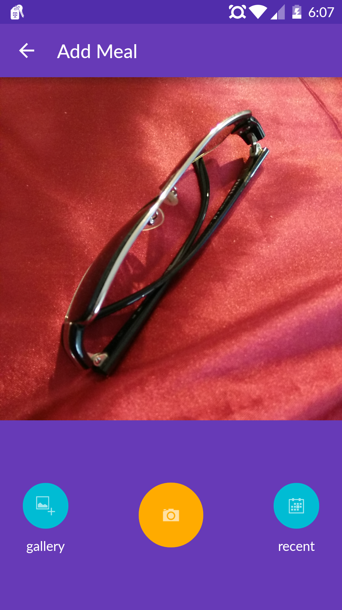
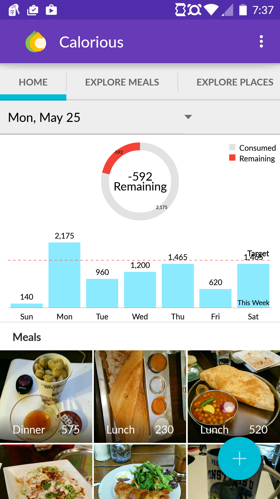
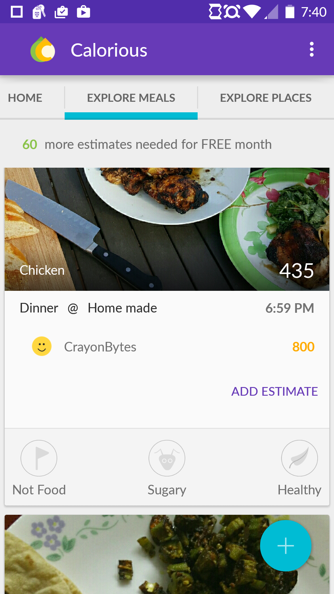
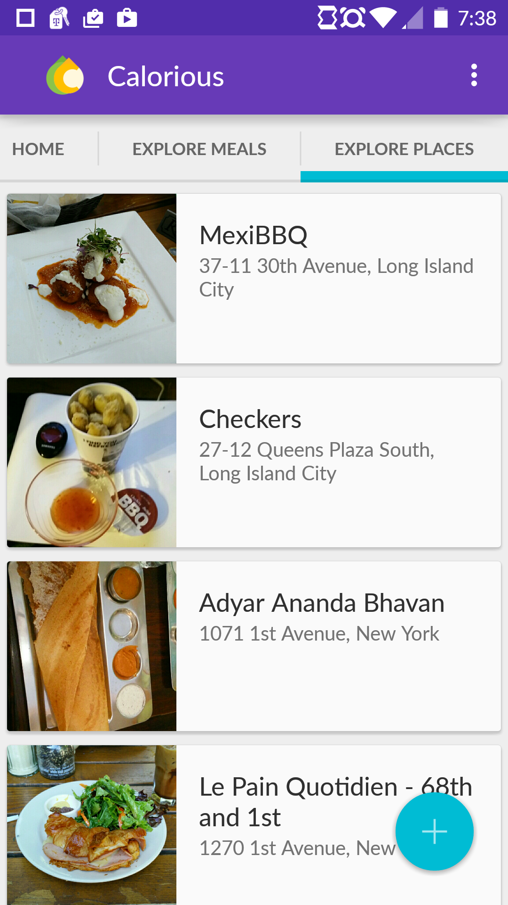
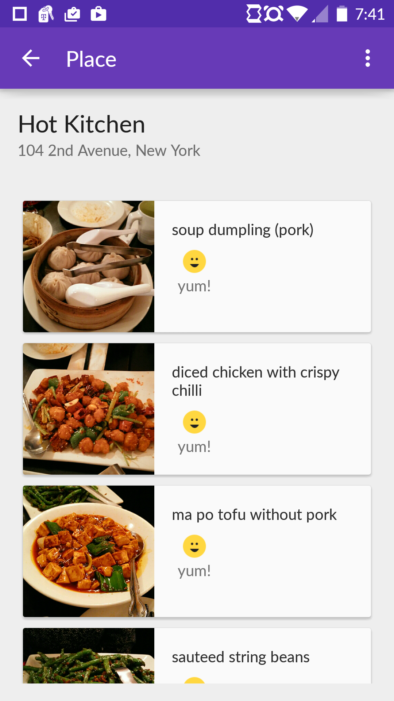

#Overview
Calorious is a crowd sourced calorie estimation native android app. The idea is to allow users to take pictures of what they eat and let the crowd estimate the number of calories. Coming to the Google Playstore Soon...

#<i class="fi-page-multiple text-purple"></i> Stack
* __Client Side__ - Native Android
* __Backend__ - Parse

#Features

##Allow submitting pictures via camera, gallery or recently uploaded meal.

##Show daily target and calorie consumption

##Along with calorie estimation, users get back binary feedback like sugary or healthy. 

##Ability to explore places around you and checking out picture menu.

