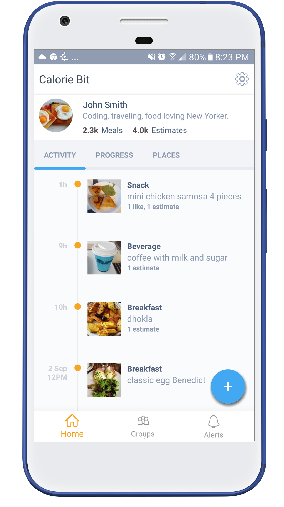

# Overview
Calorious is a calorie estimation and workout journal. The idea is to allow people to create groups and share their healthy activities to allow for peer encouragement.

# <i class="fi-page-multiple text-emphasis"></i> Stack
* __Client Side__ - Native Android / iOS swift
* __Backend__
  * AWS DynamoDB
  * AWS S3
  * AWS Cognito
  * AWS Cloudfront
  * AWS Lambda

# Features

<table>
  <tr>
    <td style="width: 55%; vertical-align: top;">
      <ul>
        <li>Track meals by taking a picture</li>
        <li>Create groups of family members or friends</li>
        <li>Comment and give feedback to friends as they make healthy life choices</li>
        <li>Calculate your daily calorie budget and stick to it</li>
        <li>Maintain a timeline of your meals and workouts</li>
        <li>Keep a list of food places you visit at your fingertips</li>
      </ul>
    </td>
    <td>
      
    </td>
  </tr>
</table>
